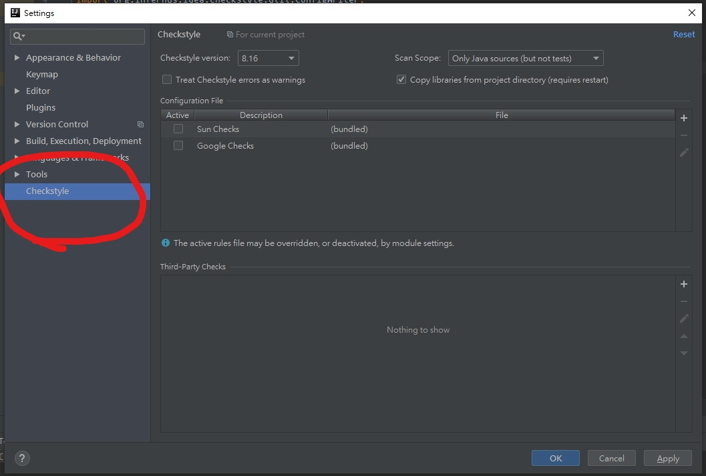
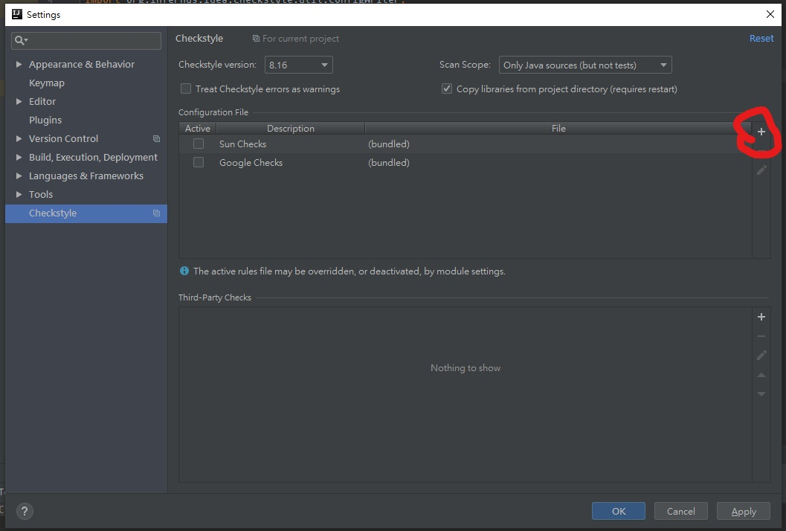
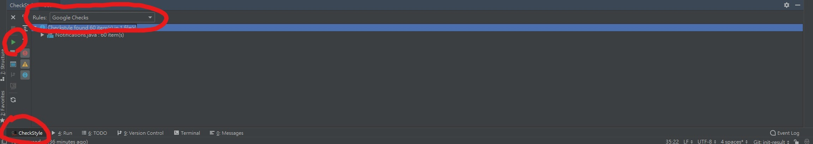

# Initial Results

## Overview
This document will walk you through the demo of the XML parser and writer in our initial result. Please follow this document accordingly to get the result we specified in the document.

## Requirements
You are require to have `IntelliJ IDEA Community Edition 2018` with plugin `checkstyle-idea` installed. To install the plugin, press **Ctrl + Alt + S** on Windows (`⌘+,` on mac) to pull out the settings page, then click on `Plugins` on the left setting menu to get into the Plugins page. In the Plugins page, click on `Marketplace`, and type in `checkstyle-idea` in the search bar. Then click on the install button of the first search result.

## Instructions

1. Clone this repo, and switch to branch `init-result`.
2. go to the root of the repo, and run the following command
```
./gradlew clean test --tests "org.infernus.idea.checkstyle.InitialResultDemo.InitialResultDemo"
```
3. You will see a file called `regenRule.xml` in the root of the directory. This is a file read in and regenerated by our parser, based on the file `google_checkstyle.xml` in repo root. **Please Make Sure You Can Find `regenRule.xml` Before Proceed**
4. Go to your intellJ with a Java file opened, press **Ctrl + Alt + S** on Windows to open `Settings`. You will should see and click on `CheckStyle` on the left menu. See following picture if you can't find it.

5. On the Checkstyle setting panel, you will want to click on the "+" button in `Configuration File` section to add `regenRule.xml`. After adding the configuration file, you will click `apply` then `ok`.

6. To see result, find the `checkstyle` tab on your side bar. Set the rules to the configuration file you have previously setup in the `Rules` dropdown. Then click on the green triangle in the `checkstyle` tab to run the check. Note the result of this check.

7. Now set the `Rules` to `Google Checks`, and then run the check on the same file we have ran in step 6. You may see the same style check result as step 6.

